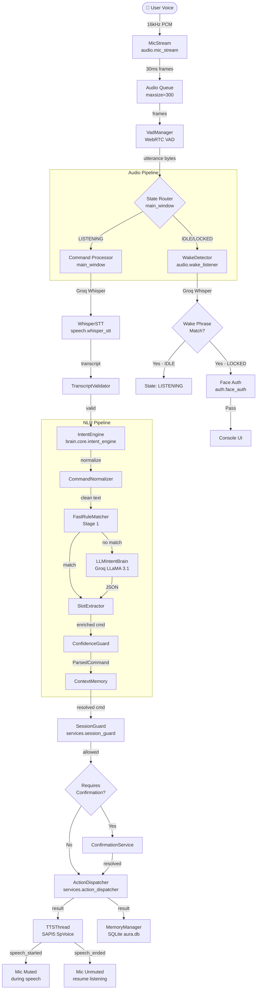

<div align="center"></div>

# AURA — AI-Powered Voice Assistant & Automation Platform

<p align="center">
  <a href="#key-features"><b>Features</b></a> •
  <a href="#system-architecture"><b>Architecture</b></a> •
  <a href="#how-it-works"><b>How It Works</b></a> •
  <a href="#technology-stack"><b>Tech Stack</b></a> •
  <a href="#installation"><b>Installation</b></a> •
  <a href="#usage-instructions"><b>Usage</b></a> •
  <a href="#project-structure"><b>Structure</b></a> •
  <a href="#example-voice-commands"><b>Voice Commands</b></a>
</p>

<p align="center">
  
  
  
  
  
  
</p>

---

AURA is a **production-grade, local desktop AI voice assistant and automation platform** built entirely in Python. It enables hands-free control of a Windows PC through natural language voice commands — with zero manual interaction required after startup.

The system features a **biometric face-authentication gateway**, a **dual-layer NLU engine** (deterministic rules + LLM fallback), **cloud-accelerated speech-to-text** via Groq Whisper, and a **native Windows SAPI5 TTS engine** — all tied together through a custom-built event-driven architecture using a publish/subscribe event bus and a validated state machine.

> Designed as a **modular, production-ready** system with clearly separated concerns: audio pipeline, authentication, natural language understanding, action dispatching, and GUI — each operating independently via events.

---

<a id="key-features"></a>

## 🌟 Key Features

### 🔒 Biometric Face Authentication Gate
- On launch, AURA starts silently in the **LOCKED** state — microphone is active, but UI is hidden.
- When the wake phrase is detected, the GUI surfaces and **OpenCV's YuNet face detector** (ONNX, ~200 KB) scans the camera.
- A **128-dimensional SFace embedding** is extracted from the detected face and compared via **cosine similarity** against stored enrollment embeddings.
- Threshold: `score ≥ 0.75` confidence to accept detection; recognition similarity must pass a tuned threshold.
- Supports **multi-user enrollment** stored in local SQLite (`aura.db`). Includes migration from legacy database automatically.
- Dev bypass via `--bypass-auth` flag for rapid iteration.

### 🎙️ Always-On Wake Word Detection
- A single `MicStream` thread captures 16 kHz mono PCM audio in **30 ms frames** (480 samples) continuously.
- **WebRTC VAD** (`webrtcvad`, aggressiveness level 2) processes each frame to detect speech onset and offset.
- A **pre-speech ring buffer** (5 frames = 150 ms) is prepended to every captured utterance to avoid clipping the first syllable.
- A complete utterance is sent to **Groq Whisper** (`whisper-large-v3-turbo`) for transcription, then matched against the configured wake phrase (`"take control"`).
- No separate wake-word model is needed — Whisper handles both wake detection and command transcription.

### 🧠 Dual-Layer Universal Intent Engine
The NLU pipeline uses a **two-stage classification** approach for reliability + intelligence:

**Stage 1 — Fast Rule Matcher (Deterministic)**
- `FastRuleMatcher` scans normalized text against curated keyword/synonym dictionaries (`synonym_map.json`, `app_mappings.json`, `site_mappings.json`).
- Returns intent with `confidence = 1.0` instantly — no API call, no latency.
- Handles the majority of everyday commands (open/close apps, search, time, weather, media, screenshot, system control).

**Stage 2 — LLM Intent Brain (Groq LLaMA Fallback)**
- If Stage 1 returns no match, text is sent to `llama-3.1-8b-instant` via Groq API with a structured system prompt.
- Returns a JSON object: `{intent, action, slots, confidence, needs_clarification, requires_confirmation}`.
- Temperature is set to `0.0` for deterministic structured outputs (`response_format: json_object`).

**Post-Processing Pipeline:**
- **Context Resolution** — pronouns like "it", "this", "that" are resolved against the `ContextMemory` (last entity mentioned).
- **Canonical Cross-Check** — if `open_app` targets a known website, intent is automatically pivoted to `open_website`.
- **Confidence Guard** — low-confidence results are escalated to conversation fallback.
- **Single-Intent Processing** — only the highest-confidence intent per utterance is executed (prevents accidental chained actions).

### 🗣️ Multi-Threaded Native TTS Engine
- `TTSThread` runs as a **dedicated QThread** with an internal `queue.Queue` for thread-safe speech requests.
- Uses **Windows SAPI5** (`SAPI.SpVoice`) via `comtypes` — no model downloads, no latency overhead.
- Speaks **asynchronously** (flag `1`) while `WaitUntilDone(100ms)` polls in a tight worker loop.
- **Immediate interrupt** capability: `stop_speaking()` calls `Speak("", 2)` (SVSFPurgeBeforeSpeak flag) to halt mid-sentence.
- Automatically selects a **male voice** (searches for "david", "mark", "james", "george" in installed voices).
- COM is initialized per-thread (`pythoncom.CoInitialize()`) and cleaned up on shutdown.
- Emits `speech_started` and `speech_ended` Qt signals — main window **mutes the microphone** during speech to eliminate feedback loops.

### 📊 Event-Driven State Machine
AURA uses a **thread-safe validated state machine** with 7 states:

```
LOCKED → IDLE → LISTENING → THINKING → EXECUTING → SPEAKING → LISTENING
```

- All transitions are validated against an allowed-transitions table — illegal transitions are logged and blocked.
- Every state change publishes a `state.changed` event on the **EventBus**, which updates the GUI, status bar, and orb visualizer in real time.
- The `StateMachine` is a thread-safe **singleton** using a `threading.Lock`.

### 📡 Thread-Safe Publish/Subscribe Event Bus
- `EventBus` is a **singleton pub/sub bus** backed by a PySide6 `QObject` with a `Signal(str, object)`.
- `publish()` is **callable from any thread** — it emits a Qt signal, ensuring callbacks always run on the Qt main thread (thread-safe UI updates).
- 20+ named event types: `auth.success`, `wake.detected`, `intent.classified`, `tts.start`, `state.changed`, `system.shutdown`, etc.

### 🛡️ Safety & Confirmation System
- Dangerous commands (`shutdown`, `restart`, `lock`, `format`, `delete`) are tagged `requires_confirmation = True` by both the rule matcher and LLM.
- A **visual confirmation dialog** (PySide6) appears simultaneously with a verbal prompt.
- User can confirm via voice ("yes", "confirm", "proceed") or cancel ("no", "cancel", "stop") within a **6-second timeout window**.
- `ConfirmationService` holds the pending `ParsedCommand` and resolves it on voice/UI response.
- `SessionGuard` enforces **role-based access control** — certain actions require fresh biometric re-authentication.

### 🌐 Action Dispatch System
All commands are dispatched through a **central `ActionDispatcher`** that routes `ParsedCommand` objects to registered handlers via `ActionRegistry`:

| Intent | Actions |
|:---|:---|
| `app_control` | Open/close any desktop application via `subprocess` + `psutil` |
| `browser_control` | Default browser launch, Google/YouTube/website search |
| `system_control` | Shutdown, restart, lock, sleep, volume, brightness |
| `weather` | Real-time weather via Open-Meteo API (geocoding + WMO codes) |
| `time` | Local time/date with formatted spoken response |
| `whatsapp` | Open WhatsApp Web chats, compose message drafts |
| `email` | Gmail compose URL with pre-filled subject/body |
| `screenshot` | Capture screen via `Pillow`, save to `data/screenshots/` |
| `media_control` | Play/pause/next/prev via `pyautogui` media keys |
| `reminders` | Schedule reminders/alarms, persist to SQLite, poll every 30s |
| `conversation` | Free-form chat via Groq `llama-3.1-8b-instant` with 10-turn history |

### 💾 Conversational Memory & Persistent Storage
- All user turns and AURA responses are logged to **SQLite** (`aura.db`) via `SQLModel` ORM.
- Memory window shows full conversation history, sortable and browsable.
- Scheduled reminders and alarms are stored in the `reminder` table and polled every 30 seconds via a `QTimer`.
- Context memory resolves pronouns across turns ("open spotify" → "close **it**").

---

<a id="system-architecture"></a>

## 📐 System Architecture

AURA uses an **event-driven, pipe-and-filter architecture** with strict separation of concerns. Each subsystem communicates exclusively through the EventBus or Qt signals — no direct cross-module calls at runtime.



---

<a id="how-it-works"></a>

## ⚙️ How It Works — Step by Step

### 1. Startup (Silent Background Mode)
```
app.py → MainWindow.__init__() → _start_pipeline()
```
- TTS thread starts and warms up SAPI5 COM object.
- `MicStream` begins capturing 30 ms PCM frames into a bounded queue (`maxsize=300`).
- A dedicated `vad-consumer` daemon thread pulls frames from the queue and feeds `VadManager`.
- App window stays **hidden** — system tray / background only.

### 2. Wake Word Detection
```
VadManager detects speech → _on_utterance_captured(audio) → _check_wake(audio) [new Thread]
```
- `WakeDetector` sends the audio buffer to **Groq Whisper** (`whisper-large-v3-turbo`).
- PCM bytes are wrapped into a WAV container in-memory (`io.BytesIO` + `wave`) before upload.
- Transcript is checked against the configured wake phrase (default: `"take control"`).

### 3. Face Authentication
```
Wake detected in LOCKED → QMetaObject.invokeMethod(_start_face_auth) → AuthWindow
```
- Window surfaces, camera activates via OpenCV.
- Per-frame: `YuNet.detect()` → `SFace.alignCrop()` → `SFace.feature()` → `cosine_similarity()`.
- Successful match emits `auth_success` signal → `_on_auth_proceed(username)`.

### 4. Command Processing
```
State: LISTENING → utterance captured → _process_command(audio) [new Thread]
State → THINKING → EXECUTING → SPEAKING
```
1. Audio → `WhisperSTT.transcribe()` → raw transcript
2. `TranscriptValidator` rejects noise/short/repeated text
3. `IntentEngine.process()` → normalize → fast match OR LLM → extract slots → resolve context
4. `SessionGuard.verify_access()` → check permissions
5. `ConfirmationService` → if dangerous, pause and ask
6. `ActionDispatcher.dispatch()` → find handler in `ActionRegistry` → execute
7. Response text → `TTSThread.speak()` + `_signals.aura_response.emit()` (GUI transcript)

### 5. Speech Output & Loop
```
TTS: speech_started → mic muted → speech_ended → mic unmuted → State: LISTENING
```
- After every response, the active window timer (300s) resets.
- If the timer expires with no further commands, state returns to `IDLE`.

---

<a id="technology-stack"></a>

## 🛠️ Technology Stack

| Layer | Component | Version / Details |
|:---|:---|:---|
| **Language** | Python | 3.12+ |
| **GUI Framework** | PySide6 (Qt for Python) | Dark Fusion theme, QStackedWidget, custom Orb visualizer |
| **STT Engine** | Groq Whisper API | `whisper-large-v3-turbo` — cloud-accelerated transcription |
| **LLM / NLU** | Groq LLaMA | `llama-3.1-8b-instant` — structured JSON intent classification |
| **TTS Engine** | Windows SAPI5 via `comtypes` | `SAPI.SpVoice`, async + interruptible, male voice selection |
| **Face Detection** | OpenCV YuNet ONNX | `face_detection_yunet_2023mar.onnx` (~200 KB) |
| **Face Recognition** | OpenCV SFace ONNX | `face_recognition_sface_2021dec.onnx` (~37 MB), 128-d embeddings |
| **VAD** | WebRTC VAD (`webrtcvad`) | 30 ms frames @ 16 kHz, aggressiveness level 2 |
| **Audio Capture** | PyAudio | 16 kHz, mono, 480-sample chunks |
| **Storage / ORM** | SQLite + SQLModel | Local `aura.db` — conversations, users, reminders |
| **Weather API** | Open-Meteo (free, no key) | Geocoding + WMO weather codes |
| **HTTP Client** | `httpx` | Async-capable, used for weather API |
| **Logging** | Loguru | Rotating file logs + Qt signal bridge for GUI display |
| **COM Interop** | `comtypes` + `pythoncom` | Windows SAPI5 SpVoice per-thread COM initialization |

---

<a id="installation"></a>

## ⚙️ Installation

### Prerequisites

1. **Python 3.12+** installed on Windows.
2. A valid **Groq API Key** — free at [console.groq.com](https://console.groq.com/).
3. A working **microphone** and **webcam** (webcam only required for face authentication).

### Step-by-Step Setup

**1. Clone the Repository:**
```bash
git clone https://github.com/Omcodesk/AURA-AI-Voice-Assistant-.git
cd AURA-AI-Voice-Assistant-
```

**2. Create Virtual Environment:**
```powershell
python -m venv .venv
.venv\Scripts\Activate.ps1
```

**3. Install Dependencies:**
```bash
pip install -r requirements.txt
```

**4. Configure API Key:**

Create a `.env` file in the root directory:
```env
GROQ_API_KEY=gsk_your_groq_api_key_here
```

**5. First Run (auto-initializes database and downloads face models):**
```bash
python app.py --bypass-auth
```
> On first run, YuNet and SFace ONNX models (~37 MB total) are downloaded automatically from the OpenCV model zoo.

---

<a id="usage-instructions"></a>

## 🚀 Usage Instructions

### Normal Mode (with Face Authentication)
```bash
python app.py
```
- AURA starts silently in the background.
- Say **"Take Control"** — the window surfaces and the camera activates for face verification.
- After successful authentication, say any command.

### Developer Mode (Skip Authentication)
```bash
python app.py --bypass-auth
```
- Skips biometric verification entirely.
- Launches directly into the console UI, logged in as `Omm`.
- Ideal for development and testing.

### Enrolling a New User
- Click the **Settings** tab → **Enroll New User**.
- Follow the on-screen prompts to capture your face from multiple angles.
- Embeddings are stored locally in `aura.db` — never uploaded anywhere.

---

<a id="project-structure"></a>

## 📂 Project Structure

```
AURA/
│
├── actions/                  # All action handlers — registered in ActionRegistry
│   ├── app_control.py        # Open/close apps via subprocess + psutil
│   ├── browser_control.py    # Browser launch + search routing (Google, YouTube, sites)
│   ├── conversation.py       # LLM chat (Groq LLaMA, 10-turn history)
│   ├── media_control.py      # Media keys (play/pause/next/prev) via pyautogui
│   ├── reminders.py          # Schedule and store reminders/alarms to SQLite
│   ├── screenshot_service.py # Screen capture via Pillow
│   ├── system_control.py     # OS-level: shutdown/restart/lock/sleep/volume/brightness
│   ├── time_service.py       # Formatted local time/date responses
│   ├── weather_service.py    # Open-Meteo API (geocoding + weather codes)
│   └── whatsapp.py           # WhatsApp Web URL automation
│
├── audio/                    # Audio pipeline — microphone → VAD → utterance
│   ├── mic_stream.py         # Threaded PyAudio capture into bounded queue
│   ├── vad_manager.py        # WebRTC VAD: 30ms frames, ring-buffer, pre-pad
│   └── wake_listener.py      # Wake phrase checker using WhisperSTT
│
├── auth/                     # Biometric security subsystem
│   ├── enroll_manager.py     # Multi-frame face enrollment + embedding storage
│   ├── face_auth.py          # YuNet detection + SFace 128-d embedding + cosine similarity
│   ├── liveness.py           # Anti-spoofing checks (blink / motion detection)
│   └── user_registry.py      # SQLite user store with aura.db / jarvis.db migration
│
├── brain/                    # NLU — intent classification and slot extraction
│   ├── core/
│   │   ├── command_normalizer.py   # Stopword removal, synonym expansion
│   │   ├── confidence_guard.py     # Low-confidence escalation logic
│   │   ├── context_memory.py       # Pronoun resolution (it/this/that)
│   │   ├── fast_rule_matcher.py    # Stage 1: keyword/synonym pattern matching
│   │   ├── intent_engine.py        # Full NLU pipeline orchestrator
│   │   ├── llm_intent_brain.py     # Stage 2: Groq LLaMA JSON classification
│   │   ├── slot_extractor.py       # Entity extraction (app, site, location, time, query)
│   │   └── time_parser.py          # NLP time/date parsing for reminders
│   ├── intent_router.py      # Maps engine output → ParsedCommand objects
│   └── memory_manager.py     # SQLModel ORM: conversations, reminders, aura.db
│
├── config/                   # Configuration files
│   ├── settings.yaml         # All tunable parameters (VAD, STT, TTS, LLM, session)
│   ├── app_mappings.json     # App name → executable mappings
│   ├── site_mappings.json    # Site name → URL mappings
│   └── synonym_map.json      # Natural language synonym dictionary
│
├── core/                     # Core infrastructure — no business logic
│   ├── action_registry.py    # Handler registration table (intent+action → function)
│   ├── command_parser.py     # Raw intent + slots → ParsedCommand dataclass
│   ├── config_loader.py      # YAML config + .env loader (singleton)
│   ├── event_bus.py          # Thread-safe pub/sub bus via Qt signals
│   ├── logger.py             # Loguru setup (rotating files + Qt bridge)
│   ├── policy_engine.py      # Safety blocklist (blocks "bye", "thanks", etc.)
│   ├── result_types.py       # ParsedCommand + ExecutionResult dataclasses
│   ├── session_manager.py    # Session lifecycle (auth, touch, auto-lock)
│   └── state_machine.py      # Validated 7-state FSM with thread-safe transitions
│
├── gui/                      # PySide6 user interface
│   ├── admin_window.py       # Settings panel
│   ├── auth_window.py        # Face authentication + enrollment screen
│   ├── confirmation_dialog.py # Voice-triggered visual confirm dialog
│   ├── console_window.py     # Main voice console (orb + transcript + state label)
│   ├── enroll_dialog.py      # New user enrollment dialog
│   ├── main_window.py        # Root window — wires all subsystems together
│   ├── memory_window.py      # Conversation history browser
│   ├── theme.qss             # Dark cyberpunk Qt stylesheet
│   └── widgets/
│       ├── activity_card.py  # "Processing..." activity display
│       ├── orb_widget.py     # Animated orb that reflects system state
│       ├── status_bar.py     # Session countdown + mic status
│       └── transcript_panel.py # Scrollable user/AURA conversation cards
│
├── services/                 # Application-layer services
│   ├── action_dispatcher.py  # Routes ParsedCommand to registered handler
│   ├── confirmation_service.py # Manages pending confirmation state
│   └── session_guard.py      # Access control — requires re-auth for sensitive actions
│
├── speech/                   # Speech I/O
│   ├── response_formatter.py # Cleans LLM output for speech (strips markdown etc.)
│   ├── transcript_validator.py # Rejects noise/too-short/hallucinated transcripts
│   ├── tts_engine.py         # TTSThread: SAPI5 SpVoice, async, interruptible
│   └── whisper_stt.py        # Groq Whisper: PCM → WAV → API → transcript
│
├── models/face/              # ONNX face models (auto-downloaded on first run)
│   ├── face_detection_yunet_2023mar.onnx   # ~200 KB
│   └── face_recognition_sface_2021dec.onnx # ~37 MB
│
├── tests/
│   └── test_universal_brain.py  # Unit tests for intent classification pipeline
│
├── .env.example              # Template — copy to .env and fill your API key
├── app.py                    # Main entry point
├── requirements.txt          # All Python dependencies
└── aura_start.bat            # One-click Windows launcher
```

---

<a id="example-voice-commands"></a>

## 💬 Example Voice Commands

| Category | Example Command |
|:---|:---|
| **Wake** | *"Take Control"* |
| **App Launch** | *"Open Chrome"* / *"Launch Notepad"* / *"Open VS Code"* |
| **App Close** | *"Close Spotify"* / *"Close Chrome"* |
| **Web Search** | *"Search for Python tutorials on Google"* |
| **YouTube** | *"Search for lo-fi music on YouTube"* |
| **Website** | *"Open GitHub"* / *"Open web.whatsapp.com"* |
| **Time** | *"What time is it?"* / *"What's today's date?"* |
| **Weather** | *"Weather in Delhi"* / *"How's the weather?"* |
| **System** | *"Shutdown the PC"* / *"Restart"* / *"Lock the computer"* |
| **Volume** | *"Increase volume"* / *"Mute"* |
| **Media** | *"Play"* / *"Pause"* / *"Next track"* |
| **Screenshot** | *"Take a screenshot"* / *"Capture screen"* |
| **WhatsApp** | *"Send a WhatsApp message to John"* |
| **Email** | *"Draft an email to boss"* |
| **Reminder** | *"Remind me to drink water at 6 PM"* |
| **Alarm** | *"Set an alarm for 7 AM"* |
| **Conversation** | *"What is machine learning?"* / *"Tell me a joke"* |

---

## 🔮 Future Enhancements

- **Offline STT** — Local Whisper.cpp integration for 100% air-gapped operation.
- **Custom Wake Phrase Training** — Real-time acoustic model fine-tuning.
- **Plugin System** — Drop-in action handlers via a plugin directory.
- **Vision Integration** — Screen-reading using a vision-language model.
- **Android Companion App** — Remote monitoring and command via mobile.

---

## 🤝 Contributing

Contributions are welcome!

1. Fork the Project.
2. Create your Feature Branch (`git checkout -b feature/AmazingFeature`).
3. Commit your Changes (`git commit -m 'Add some AmazingFeature'`).
4. Push to the Branch (`git push origin feature/AmazingFeature`).
5. Open a Pull Request.

---

## 📄 License

Distributed under the MIT License. See [`LICENSE`](LICENSE) for more information.

---

<p align="center">Built with ❤️ by <a href="https://github.com/Omcodesk">Omcodesk</a></p>
