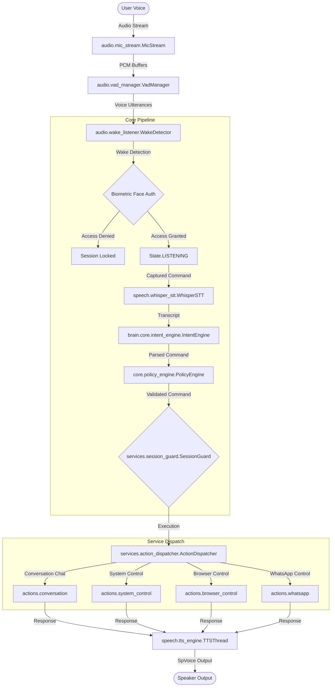

# AURA — AI-Powered Voice Assistant & Automation Platform

<div align="center"></div>

<p align="center">
  <a href="#key-features"><b>Features</b></a> •
  <a href="#system-architecture"><b>Architecture</b></a> •
  <a href="#technology-stack"><b>Tech Stack</b></a> •
  <a href="#installation"><b>Installation</b></a> •
  <a href="#usage-instructions"><b>Usage</b></a> •
  <a href="#project-structure"><b>Structure</b></a> •
  <a href="#example-voice-commands"><b>Voice Commands</b></a>
</p>

---

AURA is a production-grade, local desktop AI voice assistant and automation platform written in Python. It features a custom biometric face-authentication gateway, speech-to-text processing via Groq Whisper, and a modular action dispatch system that automates local applications, web searches, media playback, WhatsApp chats, and desktop tasks. 

Designed with a clean, decoupled design pattern (central event-bus and state-machine architecture), AURA is optimized for performance, security, and developer extensibility.

---

<a id="key-features"></a>

## 🌟 Key Features

*   **🔒 Biometric Face Authentication Gate**: Secure local user validation using YuNet and SFace models, featuring an autostart bypass flag (`--bypass-auth`) tailored for active development.
*   **🎙️ Low-Latency Speech-to-Text**: High-accuracy natural language transcription utilizing the cloud-based **Groq Whisper API**.
*   **🗣️ Responsive Speech Synthesis**: Multi-threaded native Windows SAPI5 (`SpVoice`) text-to-speech implementation with immediate interrupt capability.
*   **🧠 Universal Intent Classification**: Rules-based fallback parsing combined with LLM-powered context classification to execute complex user instructions.
*   **🌐 Default Web & Browser Automation**: Automatic detection and launching of default web browser targets (e.g. Microsoft Edge) for search and website routing.
*   **📱 WhatsApp & Email Integrations**: Direct local WhatsApp chat automation and email draft generation.
*   **📊 Clean State Machine & Events**: Robust state transitions (`LOCKED` ➔ `IDLE` ➔ `LISTENING` ➔ `THINKING` ➔ `SPEAKING`) managed via a centralized Event Bus.

---

<a id="system-architecture"></a>

## 📐 System Architecture

AURA utilizes an event-driven pipe-and-filter architecture. Raw PCM audio streams are captured by the microphone, segmented via WebRTC Voice Activity Detection (VAD), and routed through intent-parsing layers before execution.



---

<a id="technology-stack"></a>

## 🛠️ Technology Stack

| Layer | Component / Library | Details |
| :--- | :--- | :--- |
| **Language** | Python 3.12+ | Core programming environment |
| **GUI Framework** | PySide6 (Qt for Python) | Dark-mode Fusion styling, QStackedWidgets, Orb visualizers |
| **STT Engine** | Groq Whisper API | High-speed, cloud-based transcription |
| **TTS Engine** | SAPI.SpVoice via `comtypes` | Windows native multi-threaded speech synthesis |
| **Biometrics** | OpenCV Yunet & SFace | On-device face detection and embedding comparison |
| **VAD** | WebRTC VAD | Voice activity detection for silent noise rejection |
| **Storage** | SQLite / SQLModel | Local user database and conversational memory logging |

---

<a id="installation"></a>

## ⚙️ Installation

### Prerequisites

1.  **Python 3.12+** installed on Windows.
2.  A valid **Groq API Key** (obtainable from [Groq Console](https://console.groq.com/)).

### Step-by-Step Setup

1.  **Clone the Repository**:
    ```bash
    git clone https://github.com/Omcodesk/AURA-AI-Voice-Assistant-.git
    cd AURA-AI-Voice-Assistant-
    ```

2.  **Create and Activate Virtual Environment**:
    ```powershell
    python -m venv .venv
    .venv\Scripts\Activate.ps1
    ```

3.  **Install Dependencies**:
    ```bash
    pip install -r requirements.txt
    ```

4.  **Configure Environment Variables**:
    Create a `.env` file in the root directory and add your API keys:
    ```env
    GROQ_API_KEY=gsk_your_groq_api_key_here
    ```

5.  **Initialize Database**:
    Run the user registry setup or autostart setup script to initialize local databases:
    ```bash
    python check_users.py
    ```

---

<a id="usage-instructions"></a>

## 🚀 Usage Instructions

To launch the assistant normally:
```bash
python app.py
```
*Wait for the console status to display: `Pipeline started silently — waiting for wake phrase`. Say **"Take control"** to initiate biometric verification.*

### 🛠️ Developer Mode (Bypass Authentication)

If you are developing or testing and want to skip biometric verification and launch directly into the active console:
```bash
python app.py --bypass-auth
```
This flag automatically launches the UI console, bypasses camera scans, and logs in the session as `"Omm"`.

---

<a id="project-structure"></a>

## 📂 Project Structure

```
AURA/
│
├── actions/                  # Action dispatchers (APIs, tools, OS wrappers)
│   ├── app_control.py        # Launching/closing desktop programs
│   ├── browser_control.py    # Search query and default browser routing
│   └── weather_service.py    # Weather API integrations
│
├── audio/                    # Audio streaming and processing
│   ├── mic_stream.py         # Threaded PyAudio capture queue
│   ├── vad_manager.py        # WebRTC Voice Activity Detection filtering
│   └── wake_listener.py      # Low-overhead wake-word loop
│
├── auth/                     # Biometric security subsystem
│   ├── face_auth.py          # OpenCV FaceAnalyzer pipeline
│   └── user_registry.py      # User registration database (aura.db)
│
├── brain/                    # NLU and Conversational memory
│   ├── intent_router.py      # Combines rule-matcher and LLM classification
│   └── memory_manager.py     # SQLModel local context logging
│
├── config/                   # System configurations and dictionaries
│   ├── settings.yaml         # Preferred defaults (rates, volumes, models)
│   └── synonym_map.json      # Natural language mapping dictionary
│
├── core/                     # Central system architecture
│   ├── event_bus.py          # Centralized event publishing
│   └── state_machine.py      # Core transition states manager
│
├── gui/                      # Qt PySide6 user interface
│   ├── main_window.py        # Root GUI controller
│   └── console_window.py     # Active voice visualizer panel
│
└── app.py                    # Main system entry point
```

---

<a id="example-voice-commands"></a>

## 💬 Example Voice Commands

| Action | Example Command |
| :--- | :--- |
| **Biometric Wake** | *"Take control."* |
| **Google Search** | *"Search for Elon Musk on Google."* |
| **YouTube Search** | *"Search for Carrie Minati on YouTube."* |
| **Open Websites** | *"Open Google."* or *"Open web.whatsapp.com."* |
| **Application Control** | *"Open Chrome."* or *"Close Notepad."* |
| **System Info** | *"What time is it?"* or *"How is the weather?"* |

---

## 🖼️ Screenshots

<p align="center">
  <i>Console User Interface & Active Voice Waveforms (Visual placeholders)</i>
</p>
<p align="center">
  
  
</p>

---

## 🔮 Future Enhancements

*   **Offline STT Support**: Local Whisper.cpp integration for 100% offline air-gapped security.
*   **Advanced Screen Reading**: Vision-language model integration to answer questions about active visual content.
*   **Custom Wake Phrase Support**: Real-time acoustic wake word training via Few-Shot classification.

---

## 🤝 Contributing

Contributions are welcome! Please follow these guidelines:
1.  Fork the Project.
2.  Create your Feature Branch (`git checkout -b feature/AmazingFeature`).
3.  Commit your Changes (`git commit -m 'Add some AmazingFeature'`).
4.  Push to the Branch (`git push origin feature/AmazingFeature`).
5.  Open a Pull Request.

---

## 📄 License

Distributed under the MIT License. See `LICENSE` for more information.
